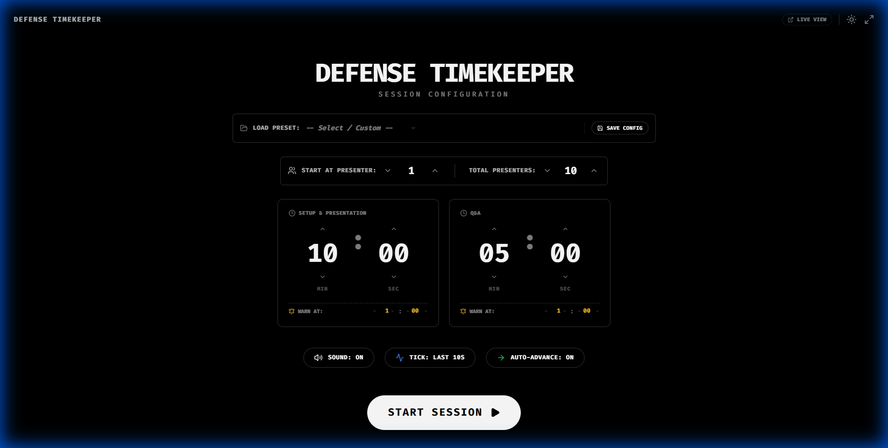

# Defense TimeKeeper

**This was made for Machine Learning Conference 2025 by Kent Paulo Delgado and Earl Josh Delgado**

## Overview

Defense TimeKeeper is a specialized timer application designed for managing presentation sessions efficiently. It provides robust tools for timing presentations and Q&A sessions, managing speaker order, and ensuring strict adherence to time limits with visual and auditory cues.



## Features

*   **Session Management:**
    *   **Configurable Presets:** Load and save session configurations to quickly switch between different defense formats.
    *   **Presenter Tracking:** easily manage the current presenter index and total number of presenters.

*   **Precision Timing:**
    *   **Dual Timers:** Separate, dedicated timers for "Setup & Presentation" and "Q&A" phases.
    *   **Customizable Duration:** Set specific minutes and seconds for each phase.
    *   **Warning System:** Visual and auditory warnings at configurable thresholds (e.g., "Warn at 1:00").

*   **Controls & Accessibility:**
    *   **Sound Controls:** Toggle global sound and enabling "Tick" sounds for the final 10 seconds.
    *   **Auto-Advance:** Option to automatically move to the next phase or presenter.
    *   **View Modes:** Support for Light/Dark themes, Fullscreen mode, and a dedicated "Live View" for audiences.

## Run Locally

**Prerequisites:**  Node.js

1.  Install dependencies:
    ```bash
    npm install
    ```

2.  Run the app:
    ```bash
    npm run dev
    ```
